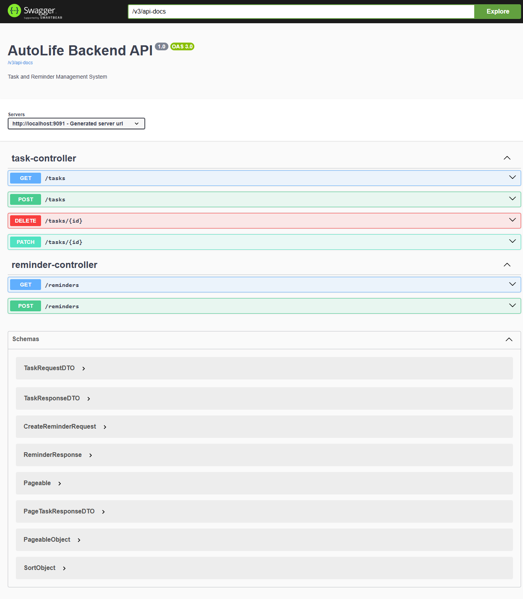

# 🚀 AutoLife Backend

A production-oriented **Spring Boot backend** for managing tasks and reminders (time-based + recurring).

---

## 🛠 Tech Stack
- Java 21
- Spring Boot
- Spring Data JPA / Hibernate
- MySQL (PostgreSQL planned)
- Maven
- Swagger / OpenAPI

---

## 🏗 Architecture
Controller → Service → Repository → Database  
DTO-based APIs, layered design, global exception handling, SLF4J logging

---

## 📦 Features

### ✅ Task Management
- CRUD + PATCH
- Priority, due date, status
- Pagination & sorting
- Dynamic filtering (Specification API)

### ⏱ Reminder System
- One-time + recurring (DAILY, WEEKLY)
- `@Scheduled` background job
- DB-driven scheduling via `nextTriggerTime`
- Recurring updates next trigger instead of completing

⚠️ Limitation: no concurrency handling yet (possible duplicate triggers)

---

## ⚙️ Validations
- Request validation using `@Valid`
- Business validations in service layer
- Input constraints for safe and consistent data

## 📡 Swagger
http://localhost:9091/swagger-ui/index.html

---

## 📡 APIs
- `POST /tasks`  
- `GET /tasks` (filters, pagination)  
- `PATCH /tasks/{id}`  
- `DELETE /tasks/{id}`  

- `POST /reminders`  
- `GET /reminders`  

---

## 🚧 Next
- Concurrency handling (optimistic locking)
- JWT auth
- Redis, Kafka
- Insights APIs
- Docker

---

## 📌 Run
mvn spring-boot:run

---

## 👨‍💻 Author
Prabhat Mishra
